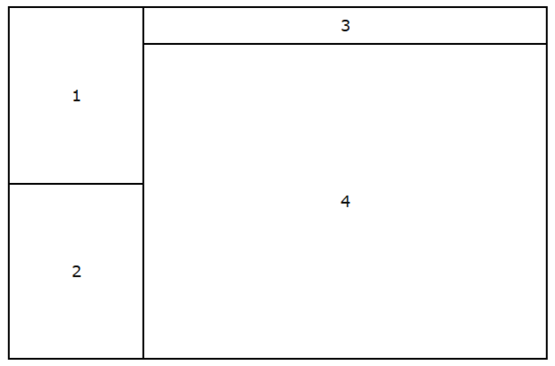

# Фреймы

**Фреймы** – это прямоугольные области экрана, каждая из которых содержит свой собственный html-документ. Фреймы использовались для оформления следующих документов:

* Оглавление. Если вы поместите на Web-страницу оглавление в виде вертикального столбца, то пользователь сможет обратиться к нему в любой момент, и ему не нужно будет постоянно щелкать на кнопке возврата к предыдущей странице. Поскольку, находясь во фрейме, оглавление всегда будет под рукой, пользователю нужно будет просто выбрать другой его пункт и сразу же получить нужную информацию.
* Неподвижные элементы интерфейса. Можно зафиксировать на экране какое-то графическое изображение, например, логотип фирмы, в то время как остальная часть страницы будет прокручиваться в другом фрейме.
* Формы и результаты. Можно создать форму в одном фрейме, а в другом отобразить результаты запроса.

## Тег ```<frameset>```

Тег ```<frameset>``` заменяет тег ```<body>``` и используется для разделения экрана. Имеет закрывающий тег.

## Атрибуты тега ```<frameset>```
cols - Делит экран по вертикали. Принимает значения в пикселях, в процентах или просто *. Значение * говорит о том, что конкретный столбец будет занимать всю остальную часть экрана

rows - делит экран по горизонтали. Принимает значения в пикселях, в процентах или просто *. Значение * говорит о том, что конкретная строка будет занимать всю остальную часть экрана

frameborder - определяет наличие рамок, т.е. границ фреймов. Принимает значения "yes" или "no"

border - ширина рамки в пикселях

bordercolor - цвет рамок. По умолчанию (если используется стандартная цветовая схема системы Windows) границы фреймов имеют тусклый, серый оттенок. Но при желании можно выбрать любой другой цвет. При определении цвета можно выбрать как его название, так и числовой эквивалент в системе RGB. Например, blue или #0000ff

В отдельном теге ```<frameset>``` имеет смысл использовать только один из атрибутов – cols или rows. Это означает, что фреймовая структура будет состоять или только из столбцов, или только из строк. Чтобы создать строки внутри столбцов или столбцы внутри строк, вам потребуется вложенные контейнеры ```<frameset>…</frameset>.```



## Тег ```<frame>```

Тег ```<frame>```, помещенный в контейнер ```<frameset>…</frameset>```, определяет, что именно должно отображаться в конкретном фрейме. Не имеет закрывающего тега.

Атрибуты тега ```<frame>```
src - URL, связанный с конкретным фреймом

marginwidth - расстояние между содержимым фрейма и его границами справа и слева

marginheight - расстояние между содержимым фрейма и его границами сверху и снизу

scrolling - определяет присутствие в окне фрейма полосы прокрутки. Может принимать значения "yes", "no" и "auto" (по умолчанию)

noresize - определяет границы фрейма как "жестко закрепленные" и не позволяет пользователю изменить размеры окна фрейма. Причем фиксируются размеры всех фреймов, имеющих с закрепленным общую границу

frameborder, border, bordercolor - эти атрибуты связаны с рамками и аналогичны таким же в теге ```<frameset>```

name - имя окна фрейма. Единственный атрибут, не влияющий на внешний вид фрейма. Позволяет контролировать процесс загрузки фреймов. Если окно фрейма имеет уникальное имя, то к нему можно непосредственно обратиться из других фреймов. Присваивая имена окнам фреймов, надо помнить об одном ограничении: имя не должно начинаться с символа подчеркивания "_", иначе оно будет игнорироваться, так как с этого символа начинаются некоторые служебные имена

Тег ```<base>```

Тег ```<base>``` избавит вас от необходимости повторять атрибут target в каждой отдельной гиперссылке, если все они указывают на одно и то же окно фрейма. Для этого надо поместить тег ```<base>``` с атрибутом target в контейнер ```<head>…</head>```.

Использование тега ```<base>``` даст возможность уменьшить размер файла оглавления left.htm предыдущего примера.

## Почему тег ```<frame>``` устарел?

Тег ```<frame>``` устарел, потому что вызывает значительные проблемы с удобством использования, доступностью и SEO.

Фреймы могут затруднить пользователям понимание структуры сайта и его содержимого. Кроме того, многие современные браузеры и устройства не поддерживают фреймы должным образом.

Вместо тега ```<frame>``` рекомендуется использовать более современные подходы, такие как ```<iframe>``` и CSS для целей вёрстки. 